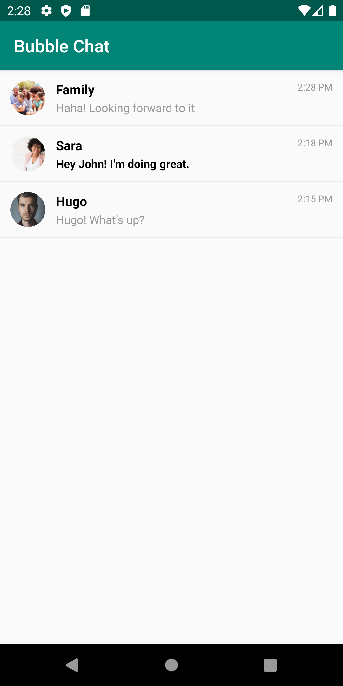

# Bubble Chat: Building iOS Style Chat in Android with Stream Chat

In this post we explore how to create message bubbles in Android that are similar to WhatsApp and iMessage. We'll customize [Stream Chat Android](https://github.com/GetStream/stream-chat-android)'s built in UI components by plugging in our own message view. This allows us to focus on the text rendering while Stream does everything else.

The source code is available [here](https://github.com/psylinse/stream-android-bubble-chat). Once we're done, we'll have a chat experience that looks like this:


## Prerequisites 

This post assumes a working knowledge of Android. If you're brand new, it may be useful to check out a [getting started](https://developer.android.com/training/basics/firstapp) guide. If you'd like to run the code, you'll need a Stream account. Please [register here](https://getstream.io/chat/trial/). Once you're registered you'll see an Stream app with an `App Id`, `API Key`, and `Secret`. 


We won't go through how to create the backend to receive our tokens in this tutorial. Please refer to [this repo](https://github.com/nparsons08/stream-chat-api) for token generation. You can also use [Stream's CLI](https://www.npmjs.com/package/getstream-cli). If you look in [MainActivity.kt](https://github.com/psylinse/stream-android-bubble-chat/blob/master/app/src/main/java/com/example/bubblechat/MainActivity.kt) you'll see placeholders to fill in run the application.

Let's build!

## Listing Channels

First, we'll create a view which displays a list of channels for a user to select:



This view is mostly taken care of by Stream's UI Components. To list our channels, the `MainActivity.kt` will leverage Stream's [ChannelList](https://github.com/GetStream/stream-chat-android/blob/master/docs/ChannelList.md). We'll configure it to load all of channels for our user. Here's the code:

```kotlin
// com/example/bubblechat/MainActivity.kt:13
class MainActivity : AppCompatActivity() {
    override fun onCreate(savedInstanceState: Bundle?) {
        super.onCreate(savedInstanceState)

        // setup the client using the example API key
        // normally you would call init in your Application class and not the activity
        StreamChat.init("<STREAM_API_KEY>", this.applicationContext)
        val client = StreamChat.getInstance(this.application)
        val extraData = HashMap<String, Any>()
        extraData["name"] = "<USERNAME>"
        extraData["image"] = "<PROFILE_IMAGE_URL>"
        val currentUser = User("<USER_ID>", extraData)
        // User token is typically provided by your server when the user authenticates
        client.setUser(
            currentUser,
            "<STREAM_FRONTEND_TOKEN>"
        )

        // we're using data binding in this example
        val binding: ActivityMainBinding =
            DataBindingUtil.setContentView(this, R.layout.activity_main)
        // Specify the current activity as the lifecycle owner.
        binding.lifecycleOwner = this

        // most the business logic for chat is handled in the ChannelListViewModel view model
        val viewModel = ViewModelProviders.of(this).get(ChannelListViewModel::class.java)
        binding.viewModel = viewModel
        binding.channelList.setViewModel(viewModel, this)

        // query all channels of type messaging
        val filter = and(eq("type", "messaging"), `in`("members", currentUser.id))
        viewModel.setChannelFilter(filter)

        // click handlers for clicking a user avatar or channel
        binding.channelList.setOnChannelClickListener { channel ->
            val intent = ChannelActivity.newIntent(this, channel)
            startActivity(intent)
        }
    }
}
```

First, we initialize our `StreamChat` instance with our api key. We configure it with the user who'll be using our application. To keep things simple, we'll just declare who's logged in and their frontend token. In a real application, you'd want to perform authentication with a [backend](https://getstream.io/blog/tutorial-user-auth-with-stream-chat-feeds/) that generates this token.

We also give the user a user id, a name, and a profile image. Once we've done this we can declare the layout `activity_main`. The view needs a view model. In this case, we'll simply use the default Stream provided `ChannelListViewModel`. This is great, as it does all the work to interact with Stream's API. We simply need to configure it to [filter](https://getstream.io/chat/docs/query_channels/?language=js) for our user's id. 

Last thing we do is set a click listener on each channel. We boot a `ChannelActivity` which is where we'll customize the chat messages. Before we look at the code for `ChannelActivity` let's look at the layout:

```xml
<!-- layout/activity_main.xml -->
<?xml version="1.0" encoding="utf-8"?>
<layout xmlns:android="http://schemas.android.com/apk/res/android"
    xmlns:app="http://schemas.android.com/apk/res-auto"
    xmlns:tools="http://schemas.android.com/tools">

    <data>
        <variable
            name="viewModel"
            type="com.getstream.sdk.chat.viewmodel.ChannelListViewModel" />
    </data>

    <androidx.constraintlayout.widget.ConstraintLayout
        android:layout_width="match_parent"
        android:layout_height="match_parent"
        tools:context="com.example.chattutorial.MainActivity">

        <com.getstream.sdk.chat.view.ChannelListView
            android:id="@+id/channelList"
            android:layout_width="match_parent"
            android:layout_height="0dp"
            android:layout_marginBottom="10dp"
            app:layout_constraintBottom_toBottomOf="parent"
            app:layout_constraintTop_toTopOf="parent"
            app:streamReadStateAvatarHeight="15dp"
            app:streamReadStateAvatarWidth="15dp"
            app:streamReadStateTextSize="9sp"
            app:streamShowReadState="true" />

        <ProgressBar
            android:layout_width="wrap_content"
            android:layout_height="wrap_content"
            app:isGone="@{!safeUnbox(viewModel.loading)}"
            app:layout_constraintBottom_toBottomOf="parent"
            app:layout_constraintEnd_toEndOf="parent"
            app:layout_constraintStart_toStartOf="parent"
            app:layout_constraintTop_toTopOf="parent" />

        <ProgressBar
            android:layout_width="25dp"
            android:layout_height="25dp"
            android:layout_marginBottom="16dp"
            app:isGone="@{!safeUnbox(viewModel.loadingMore)}"
            app:layout_constraintBottom_toBottomOf="parent"
            app:layout_constraintEnd_toEndOf="parent"
            app:layout_constraintStart_toStartOf="parent" />

    </androidx.constraintlayout.widget.ConstraintLayout>
</layout>
```

We use a `ConstraintLayout` to hold our `ChannelListView` and `ProgressBar`s. Since the view is mostly taken care of by Stream, we just need to configure when our progress bars show and what our padding and margin is. Now we're ready to view a specific channel.

## Viewing a Channel

Once a user clicks a channel, our `ChannelActivity` starts. First, let's look at how the channel information is given to us. 

 
